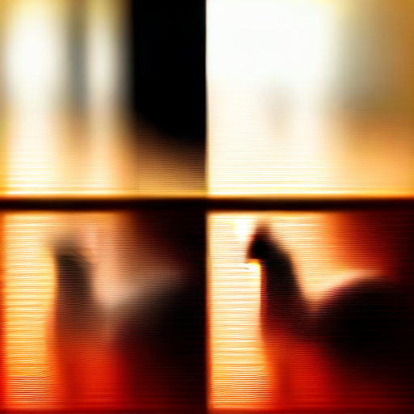

# ComfyUI on older AMD GPUs via ZLUDA — Windows

This sets up [ComfyUI](https://github.com/Comfy-Org/ComfyUI) so it actually uses
an AMD GPU that modern ROCm no longer supports. It was built by working through
the setup on a real RX 580 8GB, where the usual install path produces a
hardcoded "1 GB VRAM" message and never touches the GPU at all.

The mechanism is **ZLUDA**, which translates CUDA calls to ROCm/HIP so PyTorch
and ComfyUI can run on cards AMD has dropped. That is also why this works at
all: Microsoft's own `torch-directml` — the official path — was **deleted from
GitHub**, with its last release in September 2024.

**Please read [Before you start](#before-you-start) first.** This is unofficial
software on top of a dependency that no longer exists upstream. It works, but
nobody is obliged to keep it working.

## Which GPUs

Support is bounded by the patched rocBLAS this installs, which ships kernels
for **gfx803 and gfx900 only**. That was verified by listing the shipped kernel
files, not inferred from marketing.

| Architecture | Cards | Status |
|---|---|---|
| **gfx803** — Polaris | RX 460, 470, 480, 560, 570, 580, 590 | ✅ **Tested** on RX 580 8GB |
| **gfx900** — Vega | RX Vega 56, RX Vega 64 | ⚠️ Kernels present, not tested here |
| Anything newer | RX 5000/6000 (Navi), RDNA 2+ | ❌ No kernels in this patch |

Two things worth being precise about:

- **Upstream ZLUDA excludes these cards.** `vosen/ZLUDA` states older consumer
  GPUs (Polaris, Vega) "are not supported"; only the `lshqqytiger` fork plus the
  patched rocBLAS handles them. The setup script fetches the fork.
- **Vega is plausible, not proven.** The kernels are there, but every number in
  this README was measured on an RX 580. If you have a Vega, please open an
  issue with what you find — it is genuinely useful information.

Cards with 4 GB (RX 460/560, some 470s) are tighter than the 8 GB parts tested
here; the per-allocation ceiling below is the same, but there is less room
around it.

## What you get

- ComfyUI generating images on an RX 580
- Correct VRAM detection (ComfyUI otherwise hardcodes 1 GiB for DirectML)
- `run_zluda.bat` — one double-click to launch

Real numbers from an RX 580 8GB, SD 1.5, 512×512, 20 steps: **45–50 seconds**
once warm, and clean images up to 768×768 (115 s). The first run takes 5–10
minutes longer while ZLUDA compiles its kernels; those are cached afterwards,
so do not delete `%LOCALAPPDATA%\ZLUDA\ComputeCache`.

## Before you start

You need:

| | |
|---|---|
| OS | Windows 10 22H2 (build 19045) or Windows 11 |
| Python | **3.12, exactly** — the prebuilt wheels do not exist for 3.13. A Python without `venv` (such as ComfyUI's bundled `python_embeded`) is detected and worked around, but a normal install from python.org is easier |
| Disk | 12 GB free for the setup, plus room for models — SD 1.5 fp16 is 2 GB, SDXL base is 6.5 GB |
| RAM | 16 GB recommended; 8 GB will struggle. **Close the browser before running SDXL** — it needs roughly 16 GB of commit charge free at load time |
| Admin rights | Needed once, for the HIP SDK install |
| Connection | ~4 GB downloads in total. On a slow or metered link this takes a while |

Four things that will otherwise cost you an evening:

1. **Your antivirus will flag ZLUDA.** It uses process-hijack techniques that look
   like malware. This is a known false positive. Add an exclusion for the `zluda`
   folder or Defender will delete it mid-run.
2. **Free up RAM first.** ZLUDA compiles GPU kernels *inside* the Python process
   and needs a couple of GB on top of the model. Starved, it dies with
   `LLVM ERROR: out of memory`. The launcher closes common offenders for you.
3. **The HIP SDK is 1.26 GB and needs admin.** The script extracts only the
   libraries it needs, so nothing is installed system-wide beyond that.
4. **A single `TdrDelay` tweak can help** if you hit GPU timeouts — it needs
   admin, so the script does not do it for you.
5. **Downloads may stall on a poor connection.** The script needs about 4 GB in
   total, and the torch wheel alone is 2.6 GB. A link running below about
   1 MB/s will drop before that finishes. The script resumes where it stopped
   and verifies the result, so **re-running it always makes progress** — it can
   take several runs on a slow connection. If a file is ever reported corrupt,
   delete it from `dl/` and run again.

## Install

```
git clone <this-repo>
cd polaris-comfyui-zluda
python setup.py
```

The script checks its own prerequisites, downloads what it needs, and verifies
the GPU is visible before declaring success. If a step cannot be completed — most
likely the HIP SDK without admin rights — it stops and tells you exactly what to
run by hand.

When it finishes, double-click **`run_zluda.bat`**, then open
<http://127.0.0.1:8188>.

## Which models will work

**SD 1.5 is the practical ceiling.** Two limits combine:

- **~2 GB per single allocation.** Anything larger than that in one tensor
  segfaults the process. Measured on an RX 580: 2.0 GB works, 2.5 GB dies.
- **~6 GB usable in total** out of the 8 GB the card reports. In practice
  5-6 GB of allocations across many tensors works fine.

Neither is raised by anything in this repository. But note that the limit is on
the size of *one* allocation, not the total: a model held as many smaller
tensors is not affected, and GGUF models stay quantised and dequantise per-op
rather than into one contiguous tensor.

| Model | Result |
|---|---|
| SD 1.5 (fp16, ~2 GB) | ✅ Works |
| SD 1.5 inpainting, ControlNet | ✅ Expected to work (not measured) |
| Qwen-Image 2.1 Turbo (GGUF Q5) | ⚠️ UNet loads and computes (297 tensors, 5.01B params, bf16 attention at Qwen's real shape), but no matching VAE class exists in v0.27.0 — see below |
| SDXL base 1.0 | ✅ **Works** — 64 s at 512×512. Needs ~16 GB commit free to load |
| Flux | ? Untested. Same 2D-VAE situation as SDXL, but larger still |

### SDXL works — close everything else first

Tested on an RX 580 8GB. `sd_xl_base_1.0_0.9vae.safetensors`, 6.46 GB, 2515
tensors, downloaded from ModelScope.


*512×512, 25 steps, dpmpp_2m + karras, cfg 7 — 63.8 s, 4897 MB of the model
resident on the GPU.*

| | |
|---|---|
| Resolution | 512×512 |
| Sampler | `dpmpp_2m` + `karras`, cfg 7 |
| Steps | 25 |
| Time | **63.8 s** |
| Loaded on GPU | 4897 MB |

**VRAM was never the obstacle**, which the numbers make plain: 4897 MB is far
above the ~2 GB per-single-allocation limit elsewhere in this README, but that
limit applies to one tensor at a time, and SDXL's largest single tensor is only
56 MB.

**The one real requirement is host memory at load time.** It needs roughly
**16 GB of commit charge free** — about 10.6 GB of free RAM with nothing else
running. On a busy machine the load dies part-way with an access violation and
no Python traceback, which reads like a driver fault and is not. Close the
browser first; that is usually enough.

If you under-sample it looks broken. At 4 steps the output is heavily banded,
which looks like a hardware problem but is only step count:



*Same prompt at 4 steps. Use 25 or more.*

Checkpoint:
<https://huggingface.co/stabilityai/stable-diffusion-xl-base-1.0> →
`sd_xl_base_1.0_0.9vae.safetensors`, into `ComfyUI/models/checkpoints/`.

### Measured on an RX 580 8GB (SD 1.5, ZLUDA)

Times include model load. Roughly **2 s per step** at 512×512, plus a fixed
~10 s overhead.

| Resolution | 20 steps |
|---|---|
| 256×256 | 20 s |
| 384×384 | 30 s |
| 512×512 | 50 s |
| 640×640 | 75 s |
| 768×768 | 115 s |

| Steps (512×512) | Time |
|---|---|
| 10 | 35 s |
| 20 | 45–50 s |
| 30 | 55 s |
| 50 | 120 s |

| Batch (512×512, 10 steps) | Time |
|---|---|
| 1 | 35 s |
| 2 | 60 s |
| 4 | 120 s |

Samplers: `euler`, `euler_ancestral`, `dpmpp_2m`, `ddim` all work — `ddim` is
much the slowest at ~360 s. `dpmpp_sde` did not finish. `unipc` is rejected as
not supported in this ComfyUI version. All six schedulers work; `simple` and
`beta` are the fastest.

A good first download:
<https://huggingface.co/Comfy-Org/stable-diffusion-v1-5-archive> →
`v1-5-pruned-emaonly-fp16.safetensors`, into `ComfyUI/models/checkpoints/`.

## How it works

Modern ROCm does not support Polaris, and Microsoft's `torch-directml` — the
official DirectML package — was **deleted from GitHub**, last released September
2024. So the chain is:

```
ComfyUI  →  ZLUDA (translates CUDA calls)  →  HIP SDK  →  patched rocBLAS  →  your card
```

- **ZLUDA** from `lshqqytiger/ZLUDA` — upstream `vosen/ZLUDA` explicitly excludes
  Polaris, so the fork is required.
- **HIP SDK 5.7.1** — supplies `rocblas`/`hipblas` and the compute runtime.
- **Patched rocBLAS** from `advanced-lvl-up/Rx470-...-gfx803-gfx900-fix-AMD-GPU`.
  This is not optional: stock rocBLAS 5.7.1 ships **zero** gfx803 kernels.
- **A `sitecustomize.py` shim** backfilling five torch 2.4 APIs that ComfyUI
  expects but torch 2.2 does not have. torch is pinned to 2.2.x because
  gfx803 cannot use CUDA 12+ or torch ≥ 2.4 under ZLUDA.
- **A patch to ComfyUI itself** for the VRAM fix, the mmap flag, and cuDNN.
  Also upstream as
  [PR #16616](https://github.com/Comfy-Org/ComfyUI/pull/16616).

ComfyUI is pinned to **v0.27.0** for the same reason: v0.37+ needs torch ≥ 2.7 via
`comfy-kitchen`, which gfx803 cannot reach.

## What is not supported

- **Models whose VAE is 3D — Qwen-Image, CogVideoX and similar.** This is not a
  hardware or memory limit, and not a missing kernel either. It is a *version*
  problem, and it is why SDXL works here while Qwen-Image does not: SDXL's VAE is
  2D and v0.27.0 has a class for it.

  Measured on the Qwen-Image 2.1 VAE against ComfyUI v0.27.0: its encoder
  tensors overlap **4 of 84** with the standard `AutoencoderKL` encoder and
  **1 of 84** with hunyuan's `vae_refiner`. The checkpoint uses standard
  *naming* (`conv_in`, `down_blocks.N.conv1`, `mid_block`) but with 3D
  convolutions and RMS norms named `.gamma`. Standard `AutoencoderKL` matches
  the naming but is 2D with GroupNorm `.weight`; `vae_refiner` matches the maths
  but names blocks `down[i].block[j]`, `mid.block_1`, `conv_in.conv`. It is a
  hybrid of the two and v0.27.0 has neither. Current master handles it in the
  Wan 2.2 branch, keyed on `decoder.head.2.weight`, which this file does not
  contain.

  So the fix needs a newer ComfyUI — which needs torch >= 2.7 via
  `comfy-kitchen`, which gfx803 cannot run under ZLUDA.

  A note for anyone debugging this: **3D convolution is not the problem.**
  `torch.nn.Conv3d` and `empty_strided` both work under ZLUDA. Every
  convolution, 1d through 3d, fails identically with
  `CUDNN_STATUS_INTERNAL_ERROR` while cuDNN is enabled, which is easy to
  misread as a missing kernel. `run_zluda.bat` passes `--disable-cudnn`; if you
  test anything by hand, set `torch.backends.cudnn.enabled = False` first or
  you will diagnose the wrong thing.
- `bfloat16` — the RX 580 has no hardware support, but under **ZLUDA it works**:
  `torch.cuda.is_bf16_supported()` returns True and bf16 matmul, attention,
  layer_norm and gelu all pass. It hard-crashes under DirectML instead, so this
  is a ZLUDA-specific capability, not a Polaris one.
- SageAttention, Triton, xformers, bitsandbytes, `torch.compile`
- Multiple GPUs
- A single allocation above ~2 GB (many smaller ones are fine)

## When it breaks

It will, eventually. ZLUDA is reverse-engineered and unmaintained; torch-directml
is gone from GitHub. If setup fails, check in this order:

1. **Antivirus deleted `zluda.exe`** — restore it and add an exclusion.
2. **`LLVM ERROR: out of memory`** — close everything else and retry.
3. **`Could not find module ... cublas64_11.dll`** — the HIP SDK is missing or the
   `PATH` is wrong; re-run `setup.py`.
4. **`CUDNN_STATUS_INTERNAL_ERROR`** — the launcher should already pass
   `--disable-cudnn`; check you are running the generated `.bat`.
5. **Model runs and then dies** — you are over the VRAM ceiling. Use a smaller
   model.
6. **`No module named venv`** — you used ComfyUI's bundled Python. The script
   falls back to virtualenv automatically; if that also fails, install Python
   3.12 from python.org and re-run with it.
7. **Stuck downloading torch** — expected on a slow link. Just run `setup.py`
   again; it continues from the bytes it already has.
8. **`Package 'comfyui_workflow_templates_*' is not installed`** in the ComfyUI
   log, while the rest of the UI works — a partial download left the package
   installed but its module missing. `setup.py` now imports every pinned
   package after install and names anything broken, so this should be caught
   during setup; if it appears later, re-run `setup.py`.
9. **ComfyUI dies part-way through loading a model, with no error** — almost
   always host memory, not the GPU. There is no Python traceback, just an access
   violation and a dead process. SDXL on a 16 GB box needs ~16 GB of commit
   charge free before it starts; close the browser and anything else, and retry.

## Licence and attribution

The ComfyUI patch is contributed upstream under ComfyUI's own licence. ZLUDA,
HIP SDK and rocBLAS are downloaded from their respective authors and remain under
their own terms — this repository distributes none of them.
